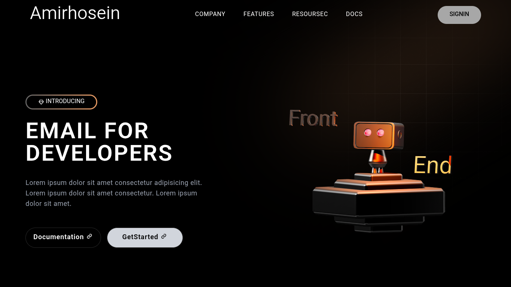

# 🚀 3D Startup App

An interactive **3D startup landing page** built with modern web technologies.

## 🧩 Tech Stack

- ⚛️ **React + Vite** – for fast and modern development
- 🎨 **Tailwind CSS** – for responsive and utility-first styling
- 🌀 **AOS (Animate On Scroll)** – for smooth scroll-based animations
- 🧊 **Spline 3D** – for interactive 3D scenes and elements

---

## 🌈 Features

- ✅ Fully responsive design (mobile-first)
- 🎬 Beautiful animations on scroll
- 🧠 Lightweight and optimized performance
- 🧩 Clean, modern UI built with Tailwind
- 🌐 Easy to deploy on GitHub Pages or Vercel

---

## 🎨 Design & Prototype

Interactive Figma prototype: [View on Figma](https://www.figma.com/design/efYbDyR2UowK68rPhgsUmg/3d-startup-app?m=auto&t=f27ae2vWoyf64b0j-6)

## 🖥 Screenshots

**Desktop view**  


**Mobile view**  


## 🎬 Screencast Demo

<video width="600" controls>
  <source src="assets/videos/output.mp4" type="video/mp4">
  Your browser does not support the video tag.
</video>

## ⚙️ Setup & Development

Clone the repository and install dependencies:

```bash
git clone https://github.com/gamirhossein792/react-3d-startup.git
cd react-3d-startup
npm install
npm run dev
```

## 🎨 Design & Prototype

Interactive Figma prototype: [View on Figma](https://www.figma.com/design/efYbDyR2UowK68rPhgsUmg/3d-startup-app?m=auto&t=f27ae2vWoyf64b0j-6)
